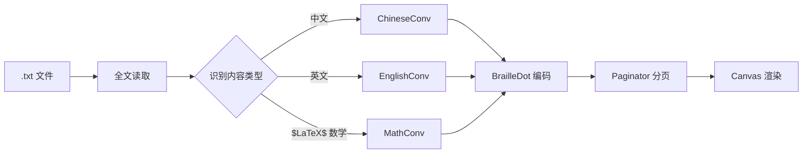

# Braille Converter 设计文档

> 中文文本 + 英文文本 → 盲文（Braille）转换与阅读器
> 配套硬件盲文点显器的桌面软件（视觉展示部分）

## 一、概述

将 .txt 文件中的中英文混合文本转换为盲文点阵，在屏幕上分页展示。软件部分先行实现，硬件驱动接口预留。

### 核心技术栈

| 组件 | 技术 |
|------|------|
| GUI 框架 | PySide6 (Qt for Python) |
| 中文→盲文 | pypinyin >= 0.55.0（Style.BRAILLE_MAINLAND / BRAILLE_MAINLAND_TONE） |
| 英文 Grade 2 → 盲文 | liblouis Python 绑定（louis 包） |
| LaTeX 数学→Nemeth Code | 自研模块（基于 Nemeth Code 规则表） |
| 打包分发 | PyInstaller（--onefile --windowed） |
| 测试 | pytest |

### 标准依据

- 中文盲文：GF 0019-2018《国家通用盲文方案》（2018-07-01 施行）
- 英文盲文：UEB（Unified English Braille），通过 liblouis 实现
- 数学盲文：**Nemeth Code**（国际上最通用的数学盲文标准，中国盲校普遍采用）

## 二、整体架构

```
main.py  (入口：启动 QApplication)
   │
   ├── src/gui/                (桌面界面层)
   │   ├── main_window.py      — 主窗口、工具栏、底部导航
   │   ├── braille_canvas.py   — Braille 点阵渲染 (QPainter)
   │   └── file_dialog.py      — 文件打开 / 拖入
   │
   ├── src/converter/          (盲文转换核心，不依赖 GUI)
   │   ├── braille_converter.py — 中/英/数学分流调度器
   │   ├── chinese_conv.py     — pypinyin → 盲文点阵
   │   ├── english_conv.py     — liblouis → 盲文 (Grade 2)
   │   └── math_conv.py        — LaTeX 数学 → Nemeth Code
   │
   └── src/paginator.py        — 按画布容量自动分页
```

职责边界：
- **converter/** 下的模块不依赖 GUI，可独立测试，后续也能用于 CLI 版本
- **gui/** 只负责呈现和交互，不包含转换逻辑
- **paginator** 接收 Braille 字符串数组和每页容量，返回二维分页数组

## 三、转换管道



### 3.1 中文盲文转换（ChineseConv）

1. 使用 pypinyin 将汉字转为拼音 + 声调
2. 拼音拆解为声母/韵母/声调
3. 声母、韵母分别映射到 Braille 点阵（pypinyin 内置映射）
4. 声调标记按 GF 0019-2018 规则附加
5. 支持 `Style.BRAILLE_MAINLAND`（无调）和 `Style.BRAILLE_MAINLAND_TONE`（带调）

### 3.2 英文 Grade 2 转换（EnglishConv）

1. 调用 `louis.translateString()` 使用 `en-ueb-g2.utb` 表
2. liblouis 自动处理大小写、数字标志符、缩写规则
3. 输出 Unicode Braille 字符

### 3.3 LaTeX 数学 → Nemeth Code（MathConv）

数学片段用 `$...$`（行内）或 `$$...$$`（独立段落）标记。转换流程：

1. **检测** — 正则匹配 `\$[^$]+\$` 和 `\$\$[^$]+\$\$` 提取数学表达式
2. **解析** — 分词解析 LaTeX 结构（命令、花括号分组、上下标、分式）
3. **转换** — 按 Nemeth Code 规则逐元素映射：

| LaTeX | Nemeth Code 说明 |
|-------|------------------|
| `\sum_{i=1}^{n}` | Nemeth 求和符号 + 下标 `i` + 等号 `1` + 上标 `n` |
| `\int_{a}^{b}` | Nemeth 积分符号 + 下标/上标区间 |
| `\frac{a}{b}` | 分式起始符 → `a` → 分式线 → `b` → 分式结束符 |
| 上下标 `^` / `_` | Nemeth 上标指示符 (dot 4 ⠈) / 下标指示符 (dot 1 ⠁) |
| 希腊字母 `\alpha` | 对应的 Nemeth 字母符号 |
| `\sqrt{x}` | 根号起始符 → `x` → 根号结束符 |

Nemeth Code 数字前加 ⠼（numeric indicator），字母保持原样。

### 3.4 内容类型识别

- 逐行扫描，区分三个通道：**中文区间**、**英文区间**、**$LaTeX$ 数学区间**
- 数学区间的优先级最高（一旦匹配 `$` 分隔符，立即转入 MathConv）
- 同一类型连续块合并为一个批次转换，结果按原文顺序拼接

## 四、UI 布局

```
┌──────────────────────────────────────────────────┐
│  📂 打开文件        第 3 / 42 页    ⟲ 重新载入    │
├──────────────────────────────────────────────────┤
│                                                  │
│  ⠓⠑⠇⠇⠕   ⠰⠉⠐⠁  ⠛⠕  ⠎⠚⠊⠑      │
│  ⠠⠉⠕⠝⠞⠑⠝⠞  ⠞⠑⠇⠇⠑⠗       │
│  ⠠⠝⠑⠭⠞  ⠏⠁⠛⠑       │
│                                                  │
│  ← 上一页                    下一页 →            │
├──────────────────────────────────────────────────┤
│  example.txt  |  共 42 页  |  当前: 第 3 页      │
└──────────────────────────────────────────────────┘
```

**交互：**
- 打开文件：QFileDialog 或窗口拖入
- 翻页：按键 ←/→，或底部按钮
- 窗口缩放 → 画布列数变化 → 自动重排分页
- 每行 Braille 字符数：根据窗口宽度自适应（默认 ~40 字）

**文件格式支持：**
- 初始：UTF-8 .txt
- 可扩展：.docx、.srt 等

## 五、分页机制

```
Paginator(braille_chars: list[str], chars_per_line: int, lines_per_page: int)
  → list[list[list[str]]]  # 页码 → 行 → Braille 字符
```

- Braille 字符序列按行容量切分行，再按页容量切分页
- 窗口尺寸变化时重新计算 `chars_per_line` 并重排
- 翻页保持当前段落的视觉连续性

## 六、边界情况处理

| 场景 | 处理方式 |
|------|----------|
| 空文件 | 提示「文件为空」，显示空白画布 |
| 非 UTF-8 | chardet 自动检测编码；失败则让用户选择 |
| 超大文件 (>10MB) | 异步读取 + 进度提示，不阻塞 UI |
| 不支持字符 | 替换为 ⠿（占位符），状态栏提示 |
| 纯英文文件 | 自动识别，全程走 EnglishConv，结果正确 |
| 窗口缩放 | 画布重排 + 重新分页，保持当前阅读位置 |
| liblouis 表缺失 | 降级仅用英文规则，弹窗警告 |
| 打包后资源路径 | 通过 sys._MEIPASS 处理路径兼容 |
| 数学表达式内的中英文 | 数学模式下只处理 LaTeX 数学符号，嵌套文本视为常量 |
| 非标准/自定义 LaTeX 宏 | 保留原文 LaTeX 源码作为 fallback，提示未翻译 |

## 七、项目文件结构

```
Braille Conversion/
├── main.py                    # 入口
├── requirements.txt           # 依赖
├── src/
│   ├── __init__.py
│   ├── gui/
│   │   ├── __init__.py
│   │   ├── main_window.py
│   │   ├── braille_canvas.py
│   │   └── file_dialog.py
│   ├── converter/
│   │   ├── __init__.py
│   │   ├── braille_converter.py
│   │   ├── chinese_conv.py
│   │   ├── english_conv.py
│   │   └── math_conv.py          # LaTeX → Nemeth Code
│   └── paginator.py
├── resources/
│   └── liblouis_tables/
│       ├── en-ueb-g2.utb
│       └── nemeth.utb            # Nemeth Code 对照表
├── tests/
│   ├── test_chinese_conv.py
│   ├── test_english_conv.py
│   ├── test_math_conv.py
│   ├── test_paginator.py
│   └── test_braille_converter.py
├── docs/superpowers/specs/
│   └── 2026-06-20-braille-converter-design.md
└── braille-converter.spec     # PyInstaller spec 文件
```

## 八、未来扩展预留

- **硬件驱动层**：预留 `src/driver/` 目录，后续通过 pyserial/pyusb 与盲文点显器通信。Converter 模块的输出可以直接喂给硬件驱动。
- **更多文件格式**：通过注册文件解析器模式扩展 .docx/.epub 等
- **命令行模式**：`braille-converter --input file.txt --output braille.txt`（converter 模块已不依赖 GUI）
- **Emoji / 代码**：后续可以映射为 Braille 专用符号

---

> 设计版本：v1.0
> 日期：2026-06-20
